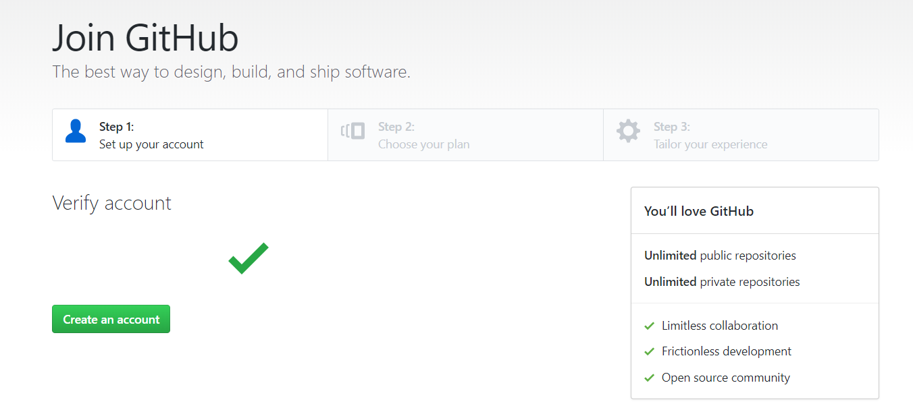
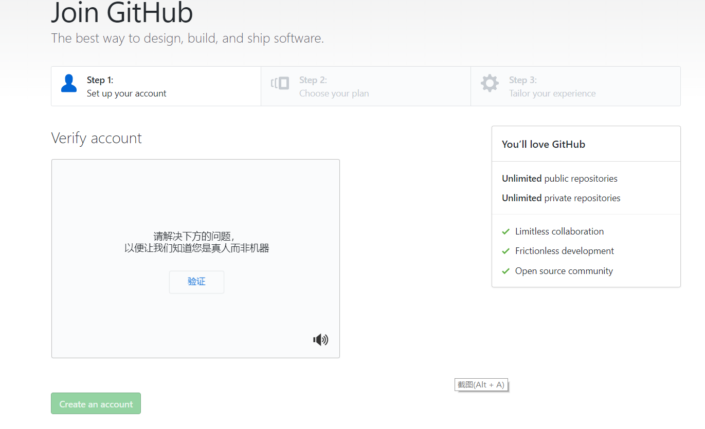
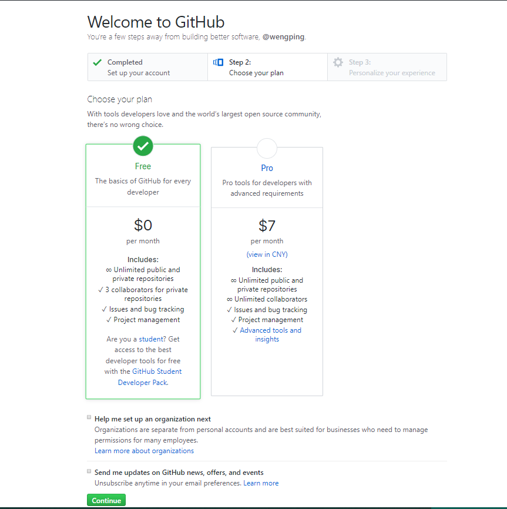
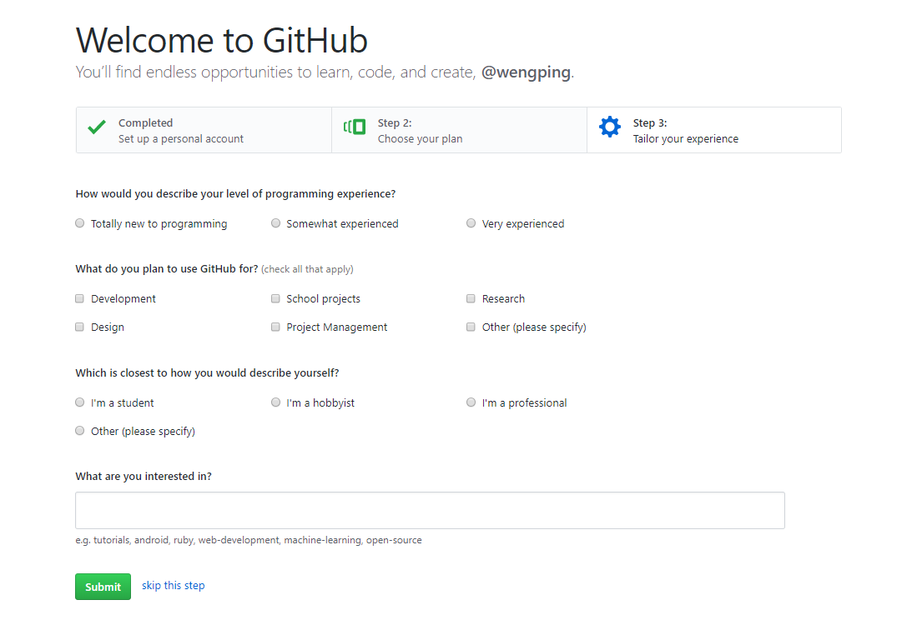
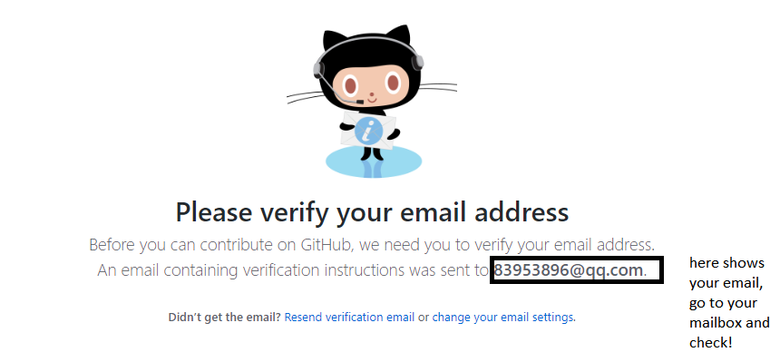
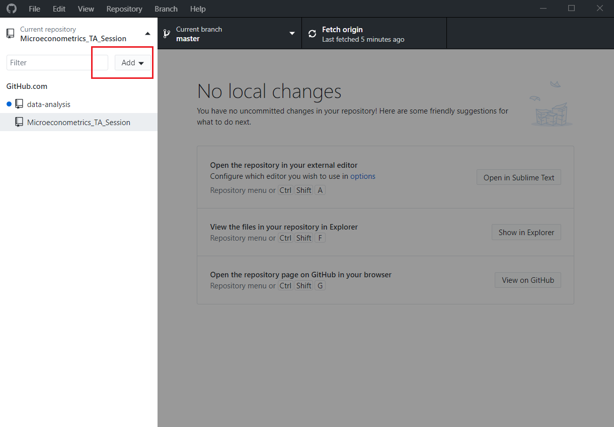
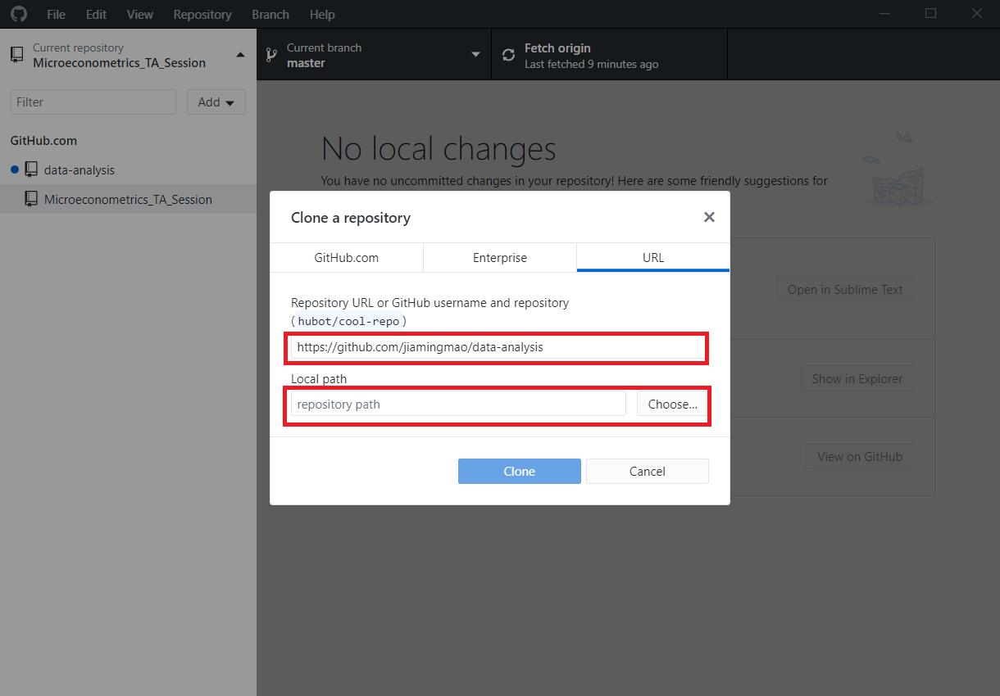

# Using git and/or Github desktop to sync course materials

## Signing up for Github service online

1. Go to GitHub's homepage (https://github.com/).
   Setting your Usernames, Email and password, then click "Sign up for GitHub"

2. Set up your account

3. Choose your personal plan with Unlimited public repositories for free.

4. Tailor your experience

5. Verify your email address

## Installating and Setting up Github Desktop

Github Desktop is a tool developed by Github. To install Github Desktop, please check your operating system, then follow the instructions.

1. Downloading GitHub Desktop  https://desktop.github.com/

2. In your computer's **Downloads** folder, double-click GitHub Desktop.

Before Installation, you should check if Microsoft .NET Framework 4.5 (or higher versions) has been installed in your computer. 

3. In the pop-up window, click **Install**.

4. After the program has been installed, click **Run**.

5. Fill in your Username (or Email) and Password to log in.

##  Downloading and sync course materials

1. Copy the URL of the repository e.g.(https://github.com/jiamingmao/data-analysis)

2. Run your GitHub Desktop and clone the repository, click the button "Add" ,than "clone repository"

3. Choose the directory you wish to clone the repository into, click **clone**, and wait for a while

4. Go to the directory and enjoy it.

## if you want to publish your writings on their github pages,please refer to this [note](https://github.com/jiamingmao/data-analysis/blob/master/Materials/Software/Git%20and%20Github/Git%20and%20Github.md)