# Install Lyx

LyX is a document processor that encourages an approach to writing based on the structure of your documents.  
LyX combines the power and flexibility of TeX/LaTeX without use of a graphical interface.  

## Install Tex distribution  
Before you install LyX on your computer, you need to install a TeX distribution first.  
For Windows there are two main choices: MiKTeX and TeXLive.For Macs there is:  MacTeX.  
here we take Windows systen and TexLive for example.  

1. go to the following page to download Texlive2018 (https://www.tug.org/texlive/acquire-netinstall.html)  
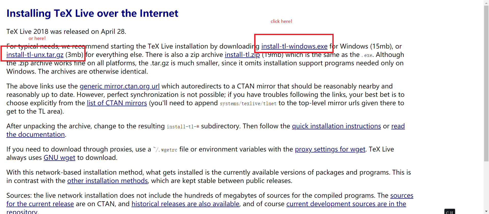  

2. double click the **.exe**file and start installing.  
  

3. click **next**  
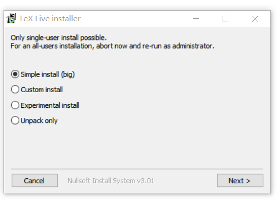  

4. click **install** to continue  
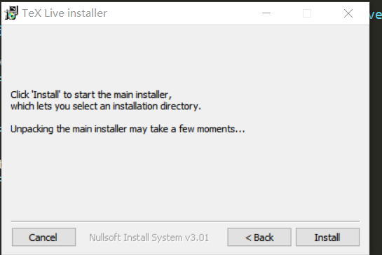  

5. click **next** to continue  
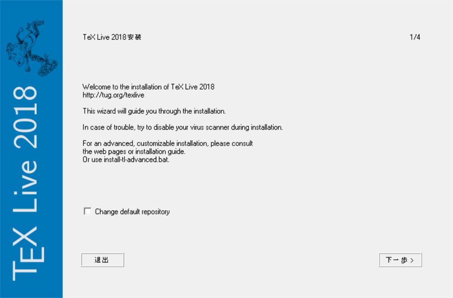  

6. change the root directory if you want , then press the button **next**  
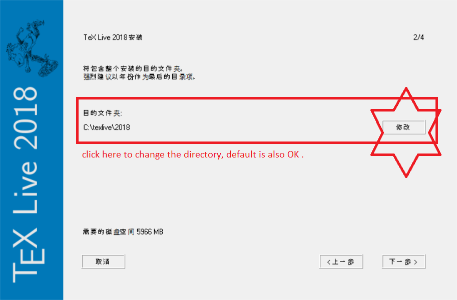  

7. adopt the default configuration  
  

8. click **install** and wait  
  

9. after the installation, you will see a **Tex Live Manager** in your start menu.  
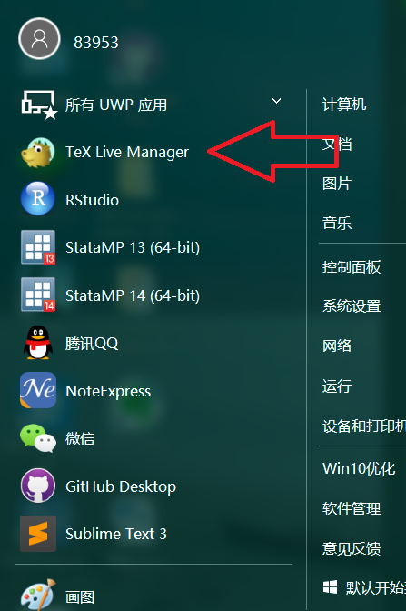  

## Install Lyx  

the official website for Lyx dowanload is (https://www.lyx.org/Download).  
The latest version of Lyx is **Lyx2.3.2**  
1. since we take Windows for example ,here we choose **Windows Installer: LyX-232-2-Installer-10.exe**  

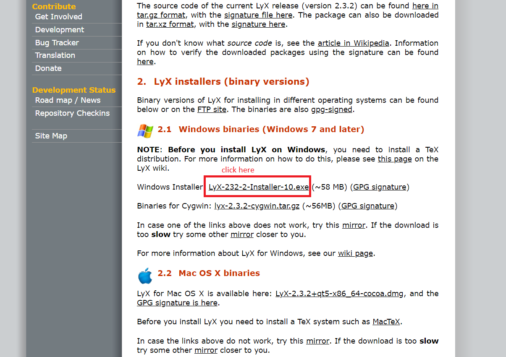  

2. double click the **.exe** file on your computer and start installing  
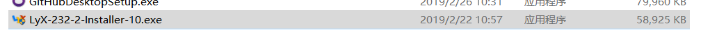  

3. click **next** to continue  
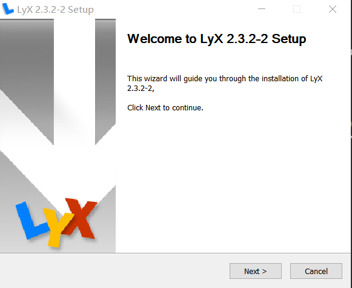  

4. click **I Agree** to continue  
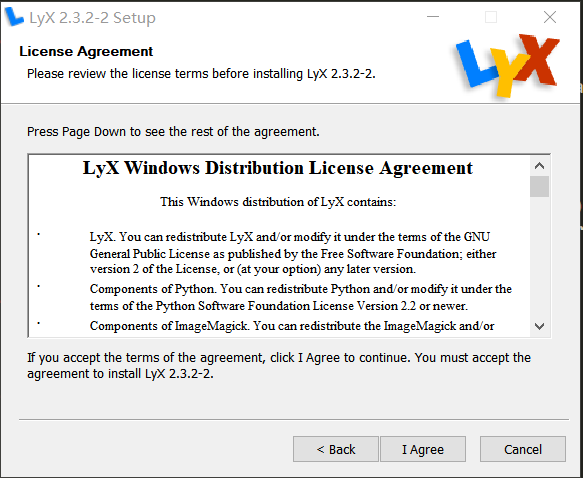  

5. choose users  
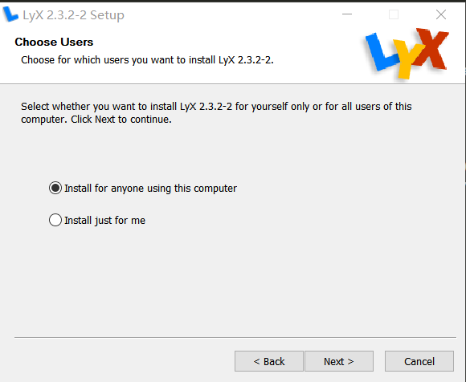

6. set your directory  
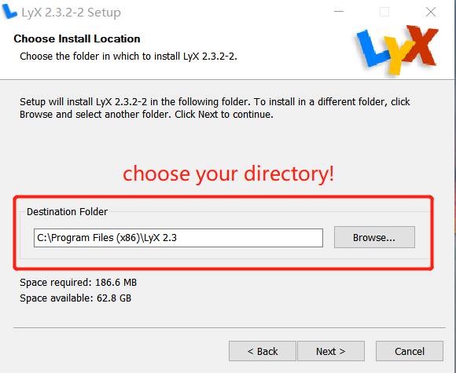  

7. choose component and click **next**  
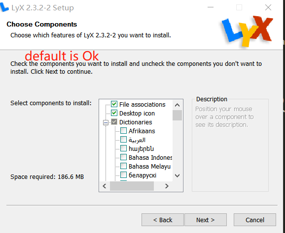  

8. creating a shortcut for Lyx in the start menu is more convienent.  
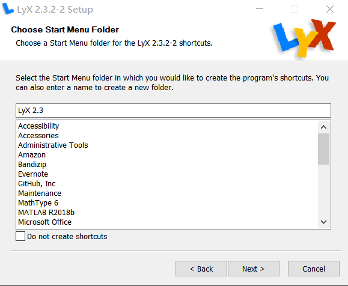  

9. make sure the Path for **latex.exe** is correct on your computer,because Lyx is oprating on Tex distributon.here,the installer will automatically detect your latex.exe path on your system since we install Tex distribution in advance. hit the key **install** to start the installation.  
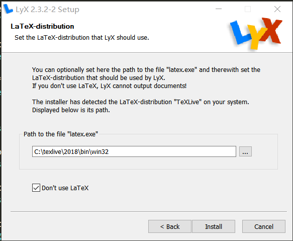
