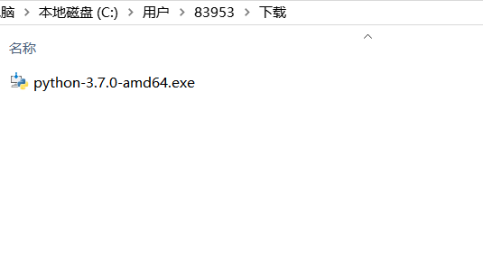
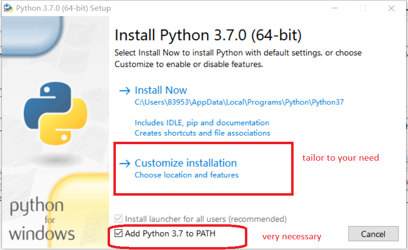
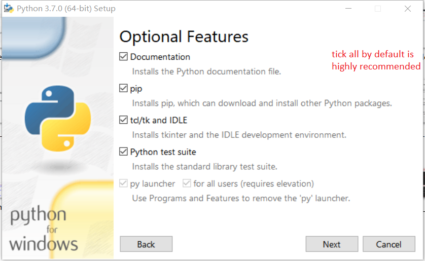
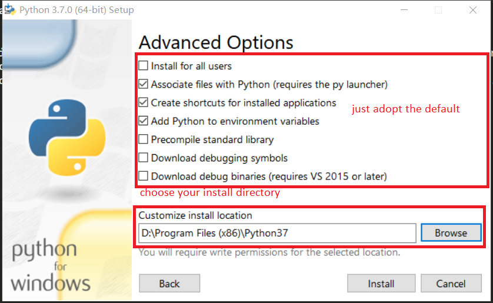
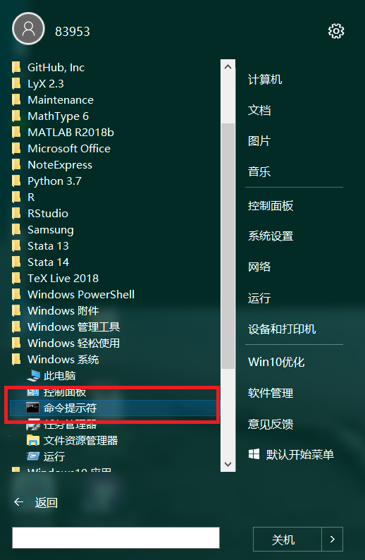
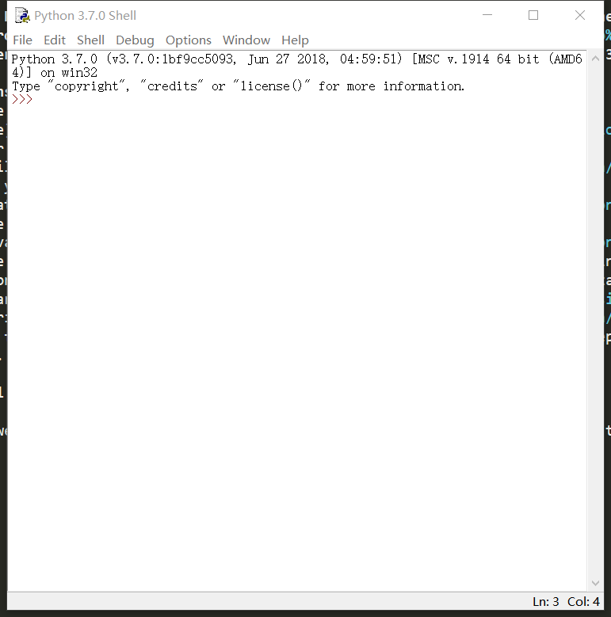
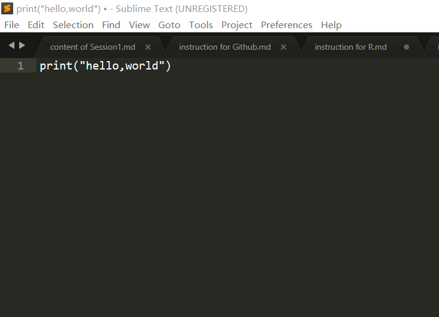
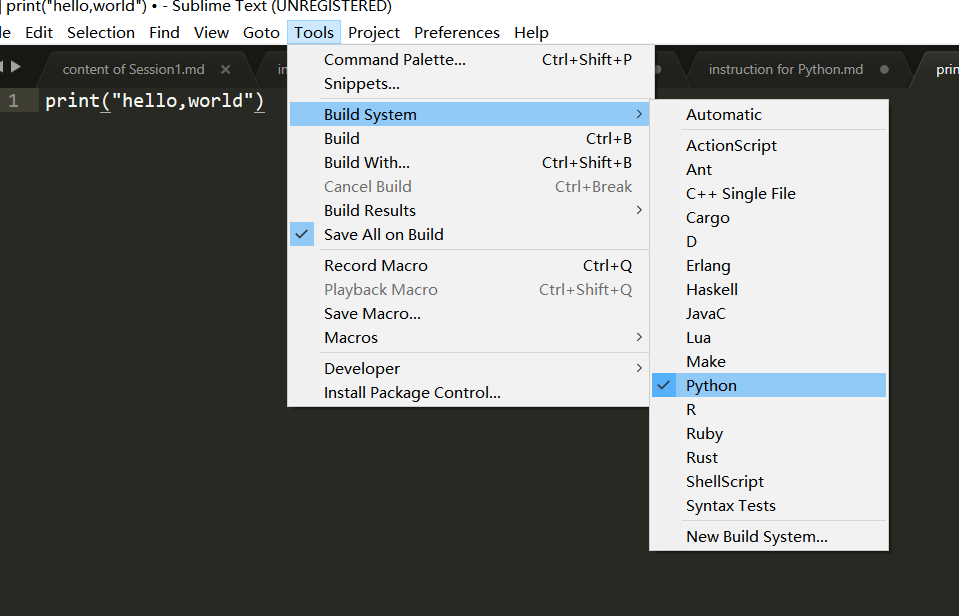
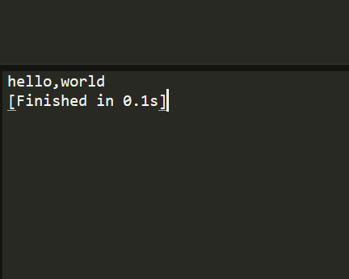

# Installing Python 

 go to Python's official website (https://www.python.org/).  
 Since the internet is very slow during  the NPC and CPPCC period, you can download Python from domestic mirror  
 (https://pan.baidu.com/s/1kU5OCOB#list/path=%2Fpub%2Fpython) .  
 Try to download the more recent version of Python （the latest version is 3.7.2 ) accourding to your computer configuration(64 bit or 32 bit, Windows or Mac)

## the installation 

1. double the ".exe" file  

2. tailor to your need  

3. stuff you choose to install , tick all of them  

4. change your install directory  

5. before using Python, we' better verify that Python is indeed successfully installed.  
One way to verify this is to open the DOS command line, type in "python".  
if it lists the following information, Python is successfully installed.  

  

6. if it fails, make sure  you tick "Add Python 3.7 to PATH" in the second step.  
if that step is correct,but Python is still failed, restart your computer.  

## use Sublime Text to write a short code

like R, we can use Python's built-in IDE "IDLE" to begin with, something looks like this  

but still you can choose other text-editors or IDE like [Atom](https://atom.io/) ,[Pycharm](https://www.jetbrains.com/pycharm/) and [Sublime Text](http://www.sublimetext.com).  
here we just use Sublime Text get some flavor of Python.  
you can download Sublime Text3 on its official website (http://www.sublimetext.com/) and its instllation is  exactly the same as conventional software.

1. write script on sublime  
  

2. compile the script  
   
or use the shortcut Key **Ctrl+B**  

3. check the result  
 

