# Installing R and RStudio

R is a free software environment for statistical computing and graphics.  

RStudio is a set of integrated tools designed to help you be more productive with R.  

before use RStudio , make sure you install R first.  

## install R  

1. log on to R's homepage (https://www.r-project.org/) and download R software  

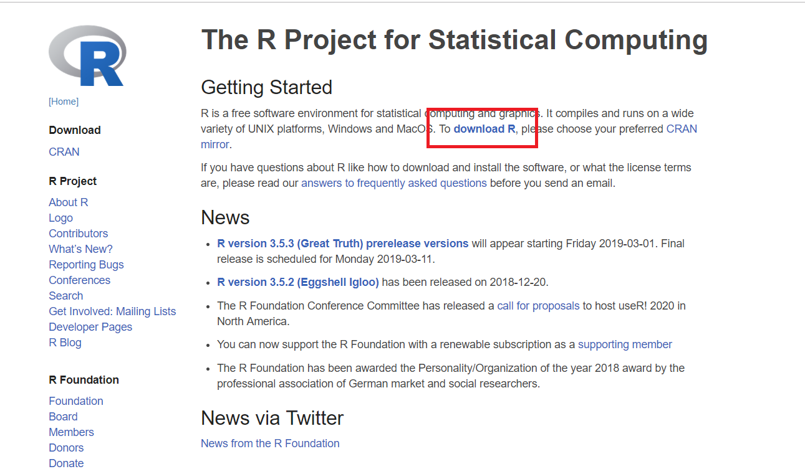  

2. choose a location close to you  

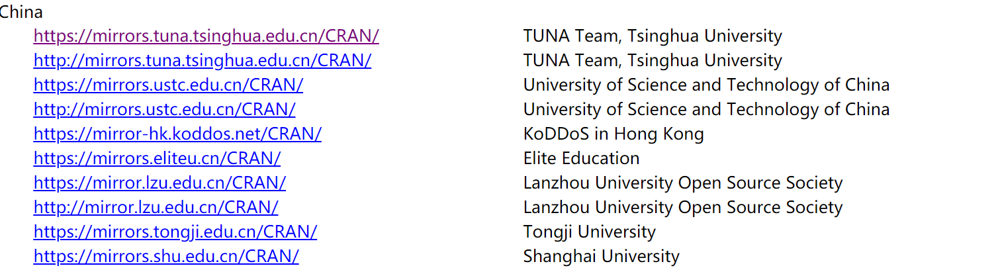  

3. down the software according to your computer system. here we take Windows for example  
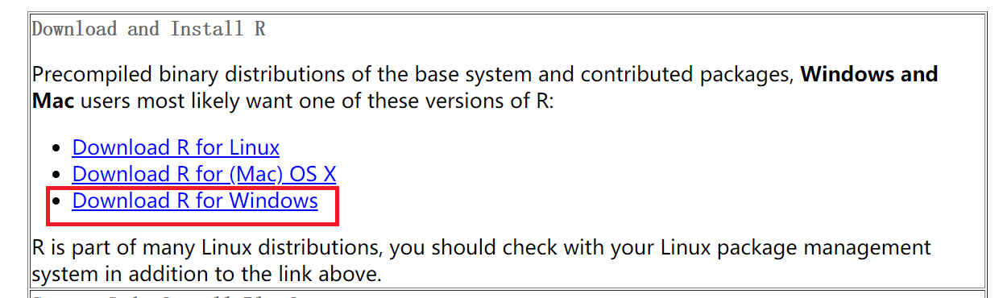  

4. for new learner , we only need to install "base"  
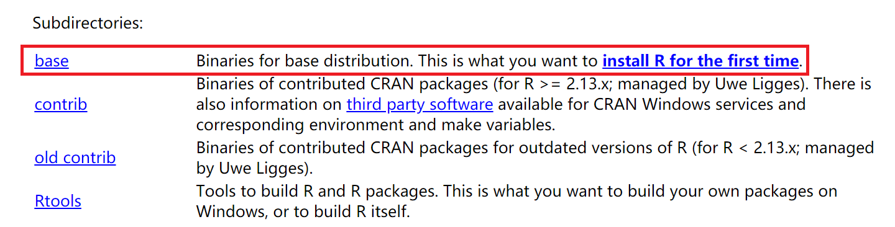  

5. now the latest version is 3.5.2  
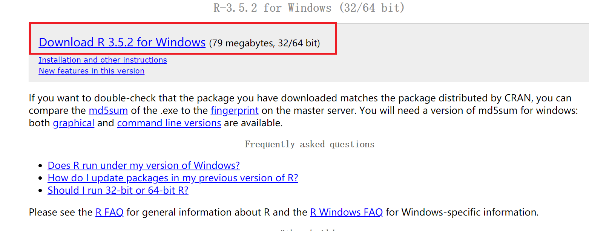  

6. double click the ".exe" file, and follow the default instructions  
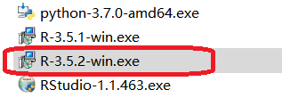  

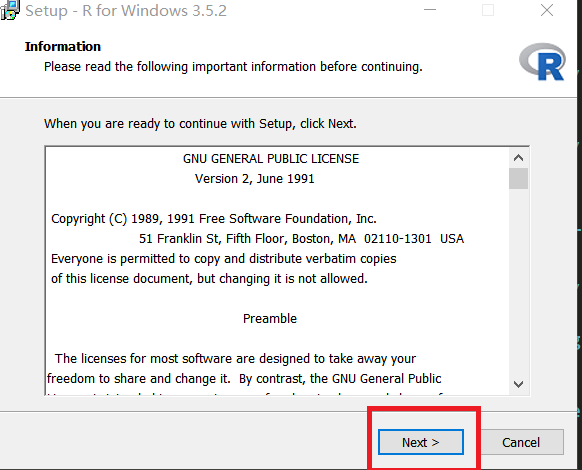  
  
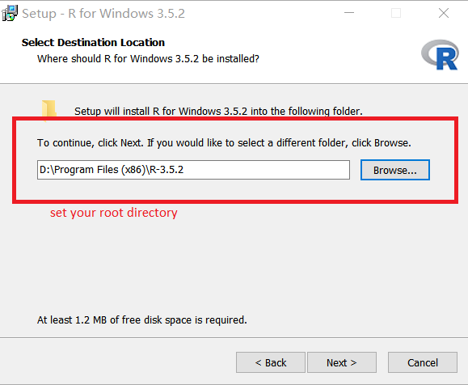  

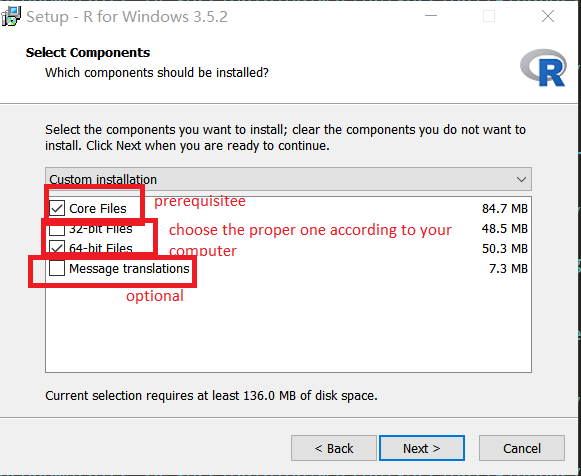  

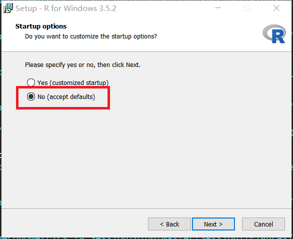  

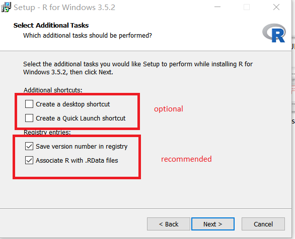  

7. press the button "next" and wait for a while, R will be installed on your computer
here is the built-in R-GUI in R, but now RStudio is more user-friendly and popular.  
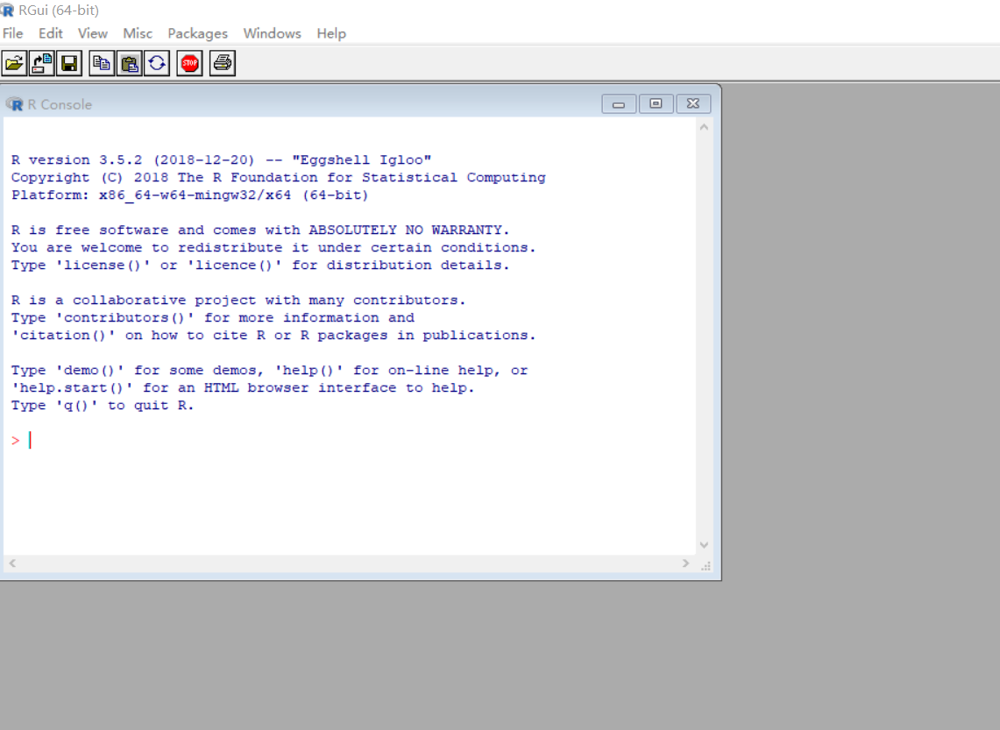  

## install RStudio  

1. log on to RStudio's homepage (https://www.rstudio.com/products/rstudio/download/) and download RStudio 
 choose the free version  
 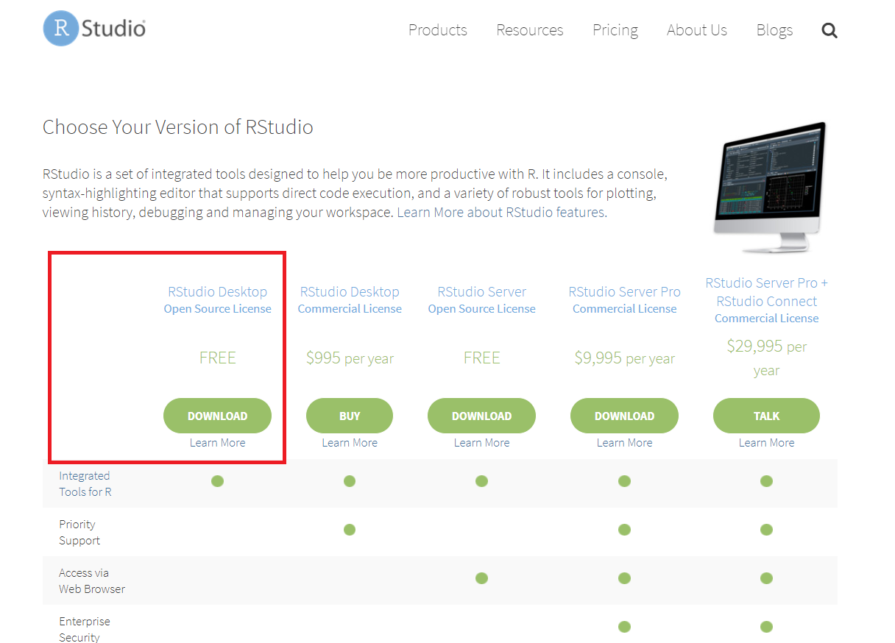  

2. select the specific version tailoring to your laptop configuration,here we take Windows for example  
 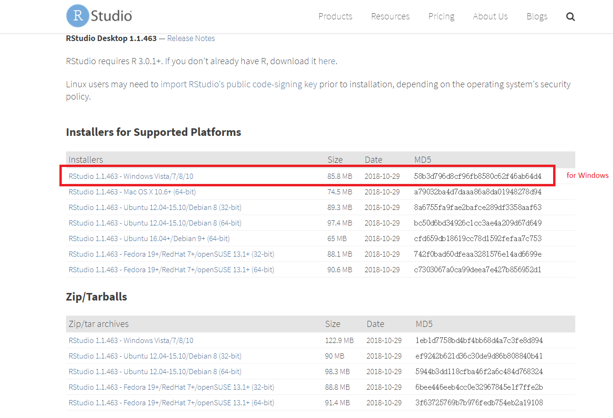  

3. In your computer's **Downloads** folder, double-click "RStudio-1.1.463.exe" file and follow the default instruction.  
  

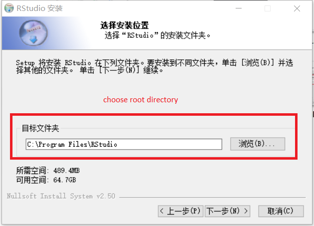  

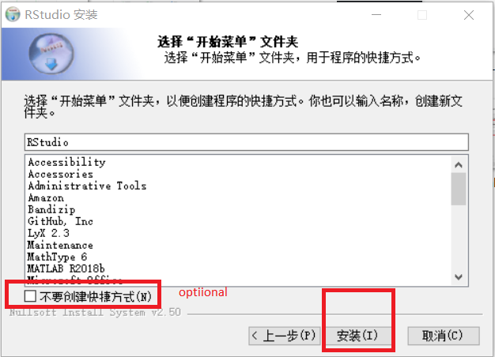 

##  a simple R program in RStudio  

1. RStudio interface  

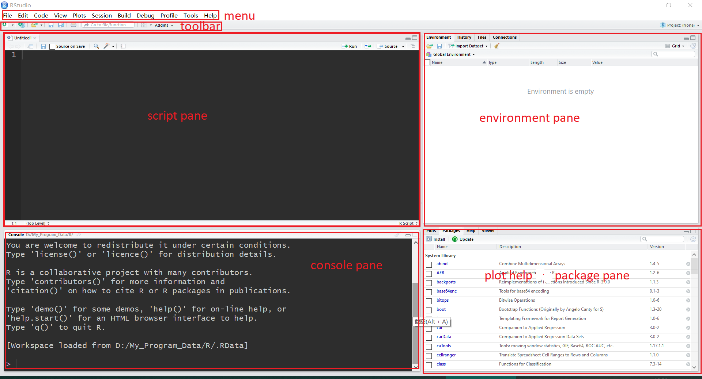  

2. a simple program in RStudio  
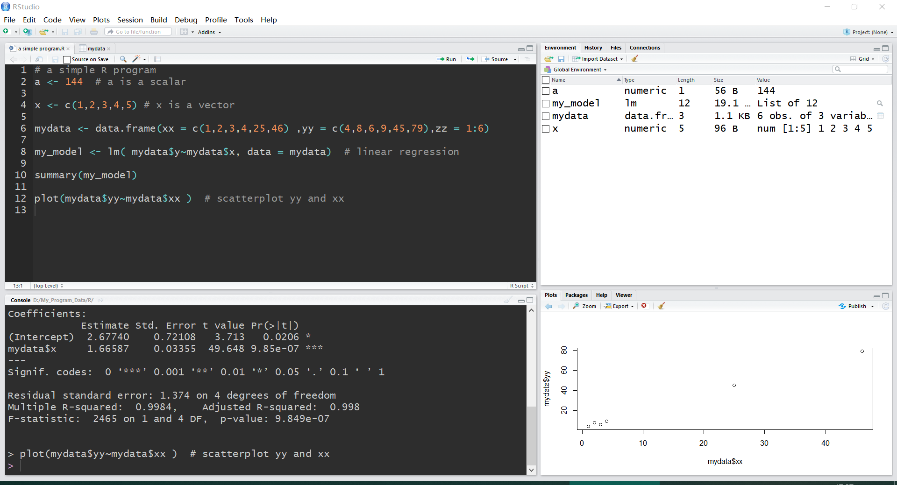  

