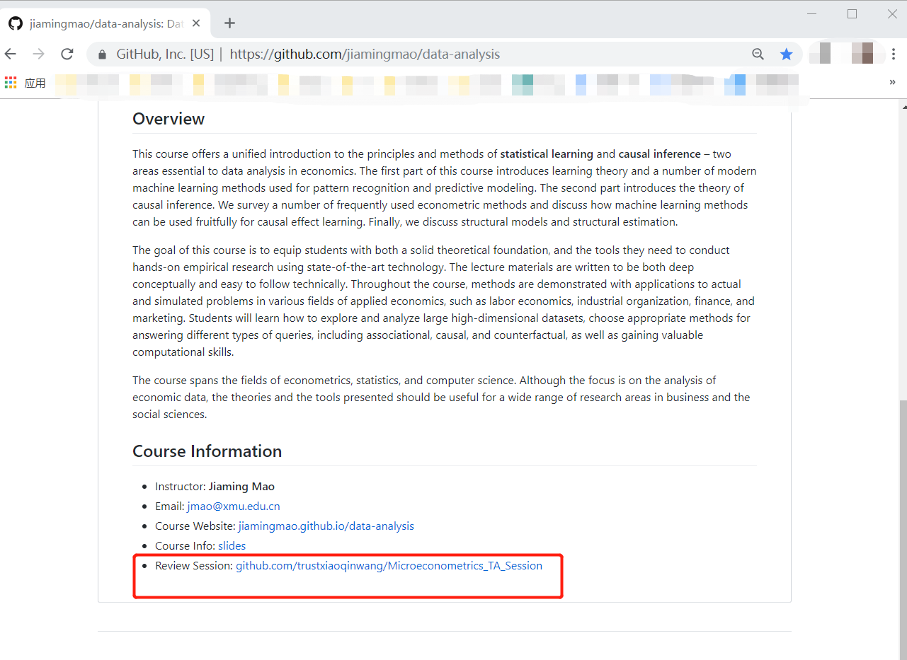
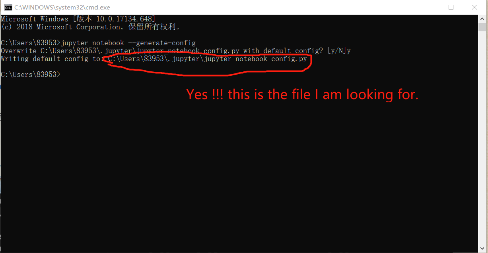
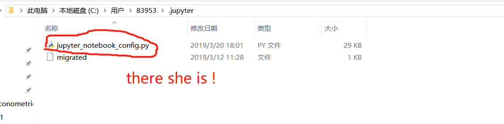
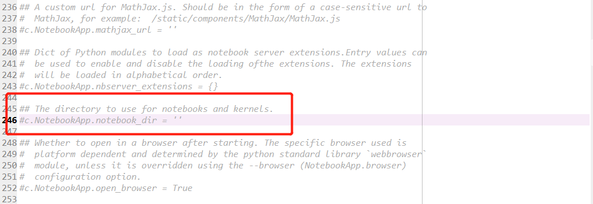
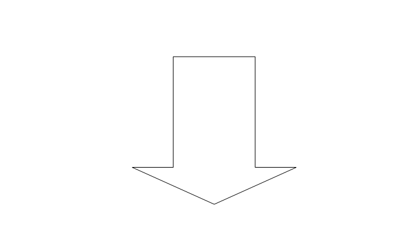
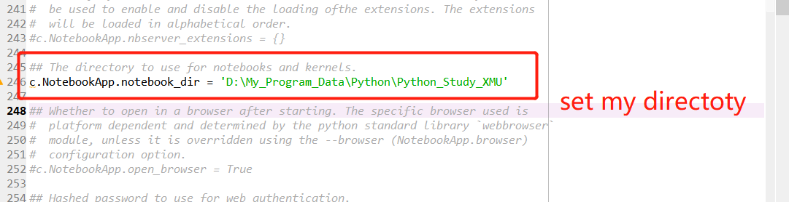
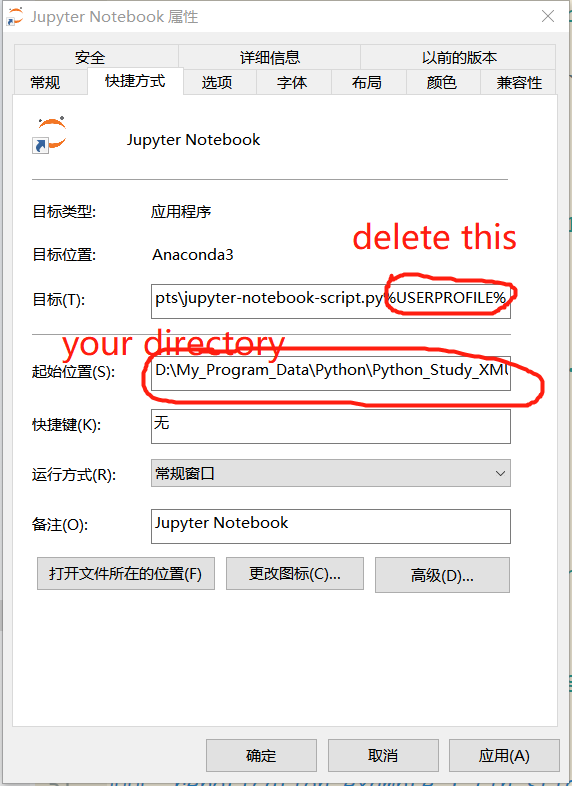
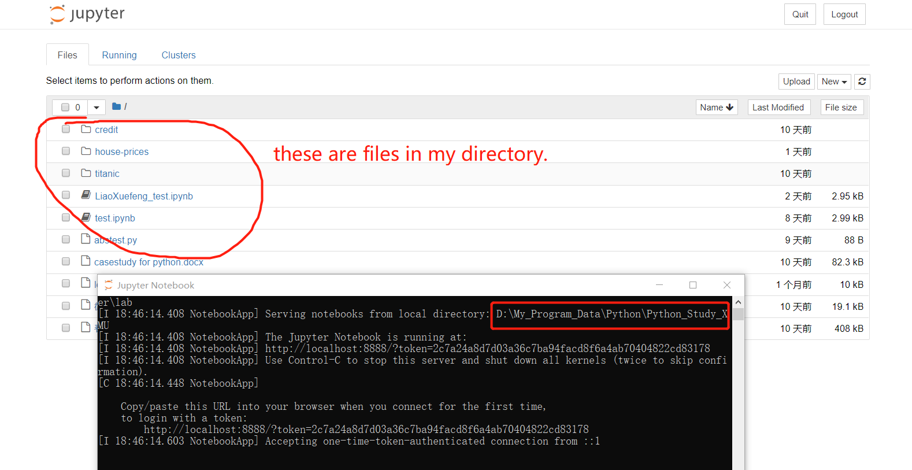

***
# Outlines of TA session 3 #
- re-emphasis resources organization of this course.
- some practical tips when you have technical problem with this course. eg markdown, R ,Python et al.
   - some useful website you can go
   - some useful book you can refer to
   - some helpful person you can ask 
- code repolication in slides ***regression*** and ***classification***  with `Python Jupyter Notebook`
***

# Resources organization of this course
### all Information and resources are perfectly integrated in the following two websites
### main course homepage
[https://jiamingmao.github.io/data-analysis](https://jiamingmao.github.io/data-analysis)
### github repo
[https://github.com/jiamingmao/data-analysis](https://github.com/jiamingmao/data-analysis)
&ensp;
Tips: you can get TA revision materials on the homepage
    
***
# Some practical tips
### _useful websites_
- Python
  - [廖雪峰个人网站](https://www.liaoxuefeng.com/)
  - [Crossin 编程教室](https://crossincode.com/home/)
### _useful books_
### _helpful person_

***
# Code repolication
### _preparation_
- change the working directory of Jupyter Notebook
  - open `cmd` and type in ` jupyter notebook --generate-config` to find where this file is on your computer.  "jupyter_notebook_config.py".
    

  - use any Software that can open `.py` format documents to open it. for example `spyder`
    

  - change the default directory to my directory
    

    

    

    and don't hesitate to click the ***save*** button.
  - right click the `Jupyter Note ` program  and open the  properties dialog. click the ***shortcut*** label and delete the `%USERPROFILE%` in the ***target*** box. rewrite  the path in the  ***starting position*** box and hit the ***apply*** button.
     

  - open Jupyter Notebook , we will see, the directory changed. Well done!!!
     

### _repolication example 1 (in slides `regression`)_
 ***demon on computer***

### _repolication example 2 (in slides `classification`)_
 ***demon on computer***
