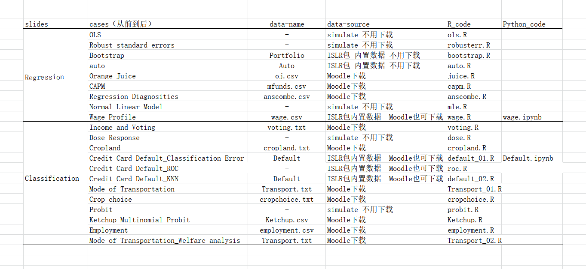

# Resources organization of this course
## main course homepage
[https://jiamingmao.github.io/data-analysis](https://jiamingmao.github.io/data-analysis)
## github repo
[https://github.com/jiamingmao/data-analysis](https://github.com/jiamingmao/data-analysis)
Tips: you can get TA revision materials on the homepage.

# Code repolication
##  _preparation_ : set the jupyter notebook  working environment
- change the working directory of Jupyter Notebook
  - open `cmd` and type in ` jupyter notebook --generate-config` to find where this file is on your computer.  "jupyter_notebook_config.py".
    
  - use any Software that can open `.py` format documents to open it. for example `spyder`
    
  - change the default directory to your directory.(* it seems that the directory cannot include numbers, please try by yourself!*)
    
    
    
    and don't hesitate to click the ***save*** button.
  - right click the `Jupyter Note ` program  and open the  properties dialog. below the ***shortcut*** label we delete the `%USERPROFILE%`  then hit the ***apply*** button.
     

  - open Jupyter Notebook , we will see, the directory changed. Well done!!!
     

##  correspondence table
an `excel` table (*slide_data_code_correspondence.xlsx*) has been created on TA's repo. it helps you  quickly find the conrespondence relation among silides,data and code.
     

##  _repolication example 1 (in slides `regression`)_
 ***demon on computer***
##  _repolication example 2 (in slides `classification`)_
 ***demon on computer***
 
# Domestic Website (专为python小白设计)
 - [Crossin的编程教室](https://crossincode.com/home/)
 - [廖雪峰Python教程](https://www.liaoxuefeng.com/)
