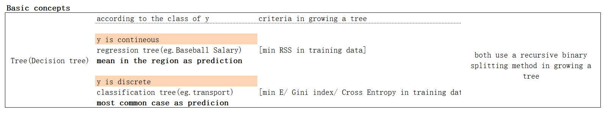

# Main content

### A brief summary of slide `Decision_Trees_and_Ensemble_Methods`

### demo two examples： `Polish bankruptcy` and `Boston House Price` in *R*

### summary some important R packages and function in implementing tree-based-methods in R

---------------------------------------------------

# A brief summary of slide `Decision_Trees_and_Ensemble_Methods`

here is the basic concept of this slide

the pros and cons of tree Decision_Trees_and_Ensemble_Methods

how to improve the performance of a single tree.the follwing table is a summary of methods we learn last week. btw, I paste the corresponding R packages.

--------   

# demo two examples： `Polish bankruptcy` and `Boston House Price` in *R*
this is the main conclusion the examples want to tell us. Two simulate examples are the same thing!

----------
### Suggesting reading :
- for more intuition and examples about randomforest , click [UC Business Analytics R Programming Guide ](https://uc-r.github.io/random_forests)
- here is a detailed introduction of R package [caret](https://topepo.github.io/caret/available-models.html)

---------
# Statistic Learning is not **Learning**, but **Doing**. So just **do** it !!!
